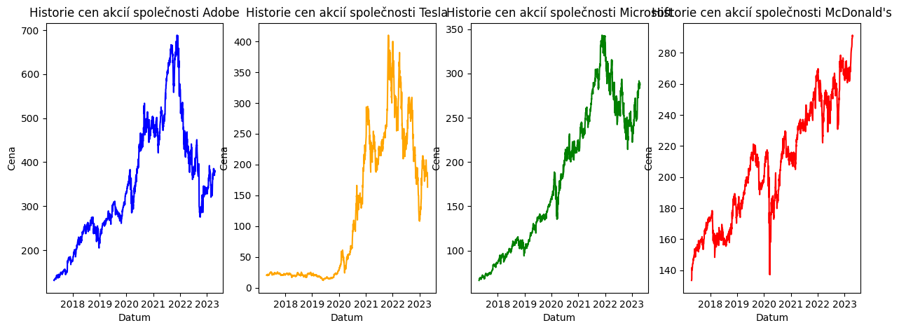
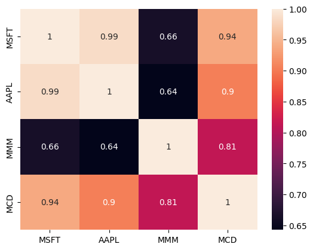
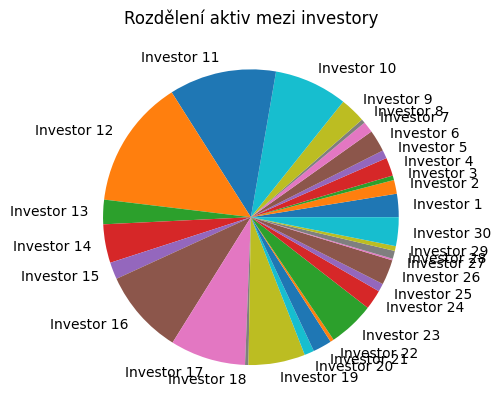

```python
a = 1
b = 2
c = a + b
print(c)
```

    3


```python
def calculator():
    num1 = float(input("Zadej první číslo: "))
    num2 = float(input("Zadej druhé číslo: "))
    operation = input("Vyber operaci (+, -, *, /): ")

    if operation == "+":
        print(num1 + num2)
    elif operation == "-":
        print(num1 - num2)
    elif operation == "*":
        print(num1 * num2)
    elif operation == "/":
        print(num1 / num2)
    else:
        print("Nesprávná volba operace")

calculator()

```

    Zadej první číslo: 15
    Zadej druhé číslo: 15
    Vyber operaci (+, -, *, /): *
    225.0


```python
import random

time_series = []

for i in range(100):
    time_series.append(random.random())

print(time_series)

```

    [0.6531404284753922, 0.36099254938981595, 0.6391714727759539, 0.16035689720402146, 0.6761113795013576, 0.01141919991711382, 0.0770893063348067, 0.8427310606890958, 0.5468687213324248, 0.8390825762298504, 0.6634600941497563, 0.7440672019229883, 0.7647267556638172, 0.7186754675806677, 0.9657018160661269, 0.1733052438021211, 0.9456884581655026, 0.18790215321232462, 0.13919392636613448, 0.14872052879726272, 0.9872377799068408, 0.8538227592107762, 0.7995668433456893, 0.8287402913449111, 0.21210493884499548, 0.16124973278320043, 0.8837489433900054, 0.9881009970186526, 0.31146182168694014, 0.2338032140190779, 0.3775390931485426, 0.30175769220790527, 0.20685623307576728, 0.5945283157927854, 0.5099781443933096, 0.9947821266385373, 0.5803369025235262, 0.3670708467893603, 0.6691576841263416, 0.4051239561935358, 0.04744118944586706, 0.902031014305199, 0.8624998485100659, 0.3458008112631331, 0.7775996277409172, 0.38513823818866, 0.6681754302151958, 0.6945222249287506, 0.49479483334872554, 0.6146827570373742, 0.03420852095209159, 0.09286236355954591, 0.38738762867863763, 0.9348169586945607, 0.8970355590825908, 0.9497125421416202, 0.9543025079319908, 0.5434266825991274, 0.6694375701671852, 0.9101768619021627, 0.5236478737727625, 0.7502627310100287, 0.8927474775622573, 0.9235629553203022, 0.7468454609481423, 0.864510991589905, 0.750728983555799, 0.7540472423619348, 0.6965850793679106, 0.18193125525119958, 0.8087348857090075, 0.2658070557985659, 0.8365591105362263, 0.7222423195375323, 0.09647704432668469, 0.7661684595581423, 0.23892979462036412, 0.29174400318662996, 0.4874411336101847, 0.8523505223383261, 0.7179055014998366, 0.6501841195196403, 0.4258346127689645, 0.2951553675930557, 0.8855993039309609, 0.3693107661854699, 0.6959019141257704, 0.10448713212549499, 0.5761421269358185, 0.9754639150356468, 0.5100286584028413, 0.5314008200469539, 0.16291886924907362, 0.9753083854002721, 0.9289527100893952, 0.425208935358119, 0.009997241203027807, 0.5311373033458515, 0.5986404110249092, 0.659430782499846]


```python
import plotly.graph_objects as go
import random

time_series = []

for i in range(100):
    time_series.append(random.random())

fig = go.Figure(data=go.Scatter(y=time_series))
fig.show()

```

```python
import plotly.graph_objects as go
import random
import datetime

time_series = []
dates = []

# Generování dat a náhodných čísel pro časovou řadu
for i in range(100):
    time_series.append(random.random())
    dates.append(datetime.date.today() + datetime.timedelta(days=i))

# Vytvoření grafu s daty na ose x
fig = go.Figure(data=go.Scatter(x=dates, y=time_series))
fig.show()

```

```python
import plotly.graph_objects as go
import random
import datetime

time_series = []
dates = []

# Generování dat a náhodných čísel pro časovou řadu s růstovým trendem
for i in range(100):
    time_series.append(100 + 10 * i + random.random() * 10)
    dates.append(datetime.date.today() + datetime.timedelta(days=i))

# Vytvoření grafu s daty na ose x a časovou řadou s růstovým trendem
fig = go.Figure(data=go.Scatter(x=dates, y=time_series))
fig.update_layout(title='Růstový trend', xaxis_title='Datum', yaxis_title='Hodnota')
fig.show()

```

```python
import plotly.graph_objects as go
import random
import datetime

time_series = []
dates = []

# Generování dat a náhodných čísel pro časovou řadu s růstovým trendem
for i in range(100):
    time_series.append(100 + 10 * i + random.random() * 10)
    dates.append(datetime.date.today() + datetime.timedelta(days=i))

# Vytvoření grafu s daty na ose x a časovou řadou s růstovým trendem se sníženou šířkou
fig = go.Figure(data=go.Scatter(x=dates, y=time_series))
fig.update_layout(title='Růstový trend', xaxis_title='Datum', yaxis_title='Hodnota')
fig.update_layout(width=600)
fig.show()

```

```python
import yfinance as yf
import plotly.graph_objects as go

# Stáhne historická data ceny akcií společnosti Tesla
tesla_data = yf.download('TSLA', start='2022-01-01', end='2022-12-31')

# Vytvoří graf pomocí knihovny Plotly
fig = go.Figure(data=go.Scatter(x=tesla_data.index, y=tesla_data['Close']))
fig.update_layout(title='Cena akcií společnosti Tesla', xaxis_title='Datum', yaxis_title='Cena')
fig.show()

```

    [*********************100%***********************]  1 of 1 completed


```python
import yfinance as yf
import plotly.graph_objects as go
import datetime

# Vypočítá datum před 10 lety pro začátek historických dat
start_date = datetime.datetime.now() - datetime.timedelta(days=365 * 10)

# Stáhne historická data ceny akcií společnosti Tesla od začátku roku 2012
tesla_data = yf.download('TSLA', start=start_date.strftime('%Y-%m-%d'))

# Vytvoří graf pomocí knihovny Plotly
fig = go.Figure(data=go.Scatter(x=tesla_data.index, y=tesla_data['Close']))
fig.update_layout(title='Cena akcií společnosti Tesla', xaxis_title='Datum', yaxis_title='Cena')
fig.show()

```

    [*********************100%***********************]  1 of 1 completed


```python
import yfinance as yf
import plotly.graph_objects as go
import datetime

# Vypočítá datum před 10 lety pro začátek historických dat
start_date = datetime.datetime.now() - datetime.timedelta(days=365 * 10)

# Stáhne historická data ceny akcií společnosti Tesla od začátku roku 2012
tesla_data = yf.download('TSLA', start=start_date.strftime('%Y-%m-%d'))

# Vypočítá denní procentuální změnu ceny akcií
tesla_data['Daily Change'] = tesla_data['Close'].pct_change()

# Vytvoří graf pomocí knihovny Plotly
fig = go.Figure(data=go.Scatter(x=tesla_data.index, y=tesla_data['Daily Change']))
fig.update_layout(title='Denní procentuální změna ceny akcií společnosti Tesla', xaxis_title='Datum', yaxis_title='Procentuální změna')
fig.show()

```

    [*********************100%***********************]  1 of 1 completed


```python
import yfinance as yf
import datetime

# Vypočítá datum před 10 lety pro začátek historických dat
start_date = datetime.datetime.now() - datetime.timedelta(days=365 * 10)

# Stáhne historická data ceny akcií společnosti Tesla od začátku roku 2012
tesla_data = yf.download('TSLA', start=start_date.strftime('%Y-%m-%d'))

# Vypočítá denní procentuální změnu ceny akcií
tesla_data['Daily Change'] = tesla_data['Close'].pct_change()

# Určí, kolikrát došlo k dennímu poklesu/zvýšení o více než 10 %
num_big_changes = len(tesla_data[abs(tesla_data['Daily Change']) > 0.1])

print(f"Počet dnů s denní změnou o více než 10 %: {num_big_changes}")

```

    [*********************100%***********************]  1 of 1 completed
    Počet dnů s denní změnou o více než 10 %: 60


```python
import yfinance as yf
import plotly.graph_objects as go
import datetime

# Vypočítá datum před 6 lety pro začátek historických dat
start_date = datetime.datetime.now() - datetime.timedelta(days=365 * 6)

# Stáhne historická data ceny akcií společností Adobe, Tesla, Microsoft a McDonald's od roku 2015
adobe_data = yf.download('ADBE', start=start_date.strftime('%Y-%m-%d'))
tesla_data = yf.download('TSLA', start=start_date.strftime('%Y-%m-%d'))
microsoft_data = yf.download('MSFT', start=start_date.strftime('%Y-%m-%d'))
mcdonald_data = yf.download('MCD', start=start_date.strftime('%Y-%m-%d'))

# Vytvoří graf pomocí knihovny Plotly
fig = go.Figure()

# Přidá data o cenách akcií společnosti Adobe
fig.add_trace(go.Scatter(x=adobe_data.index, y=adobe_data['Close'], name='Adobe'))

# Přidá data o cenách akcií společnosti Tesla
fig.add_trace(go.Scatter(x=tesla_data.index, y=tesla_data['Close'], name='Tesla'))

# Přidá data o cenách akcií společnosti Microsoft
fig.add_trace(go.Scatter(x=microsoft_data.index, y=microsoft_data['Close'], name='Microsoft'))

# Přidá data o cenách akcií společnosti McDonald's
fig.add_trace(go.Scatter(x=mcdonald_data.index, y=mcdonald_data['Close'], name="McDonald's"))

fig.update_layout(title='Historie cen akcií', xaxis_title='Datum', yaxis_title='Cena')
fig.show()

```

    [*********************100%***********************]  1 of 1 completed
    [*********************100%***********************]  1 of 1 completed
    [*********************100%***********************]  1 of 1 completed
    [*********************100%***********************]  1 of 1 completed


```python
import yfinance as yf
import seaborn as sns
import matplotlib.pyplot as plt
import datetime

# Vypočítá datum před 6 lety pro začátek historických dat
start_date = datetime.datetime.now() - datetime.timedelta(days=365 * 6)

# Stáhne historická data ceny akcií společností Adobe, Tesla, Microsoft a McDonald's od roku 2015
adobe_data = yf.download('ADBE', start=start_date.strftime('%Y-%m-%d'))
tesla_data = yf.download('TSLA', start=start_date.strftime('%Y-%m-%d'))
microsoft_data = yf.download('MSFT', start=start_date.strftime('%Y-%m-%d'))
mcdonald_data = yf.download('MCD', start=start_date.strftime('%Y-%m-%d'))

# Vykreslí 4 grafy pomocí knihovny Seaborn a Matplotlib v jednom řádku
fig, axes = plt.subplots(1, 4, figsize=(15,5))

sns.lineplot(ax=axes[0], x=adobe_data.index, y=adobe_data['Close'], color='blue')
sns.lineplot(ax=axes[1], x=tesla_data.index, y=tesla_data['Close'], color='orange')
sns.lineplot(ax=axes[2], x=microsoft_data.index, y=microsoft_data['Close'], color='green')
sns.lineplot(ax=axes[3], x=mcdonald_data.index, y=mcdonald_data['Close'], color='red')

# Nastaví názvy os a titulek
axes[0].set(title='Historie cen akcií společnosti Adobe', xlabel='Datum', ylabel='Cena')
axes[1].set(title='Historie cen akcií společnosti Tesla', xlabel='Datum', ylabel='Cena')
axes[2].set(title='Historie cen akcií společnosti Microsoft', xlabel='Datum', ylabel='Cena')
axes[3].set(title='Historie cen akcií společnosti McDonald\'s', xlabel='Datum', ylabel='Cena')

plt.show()

```

    [*********************100%***********************]  1 of 1 completed
    [*********************100%***********************]  1 of 1 completed
    [*********************100%***********************]  1 of 1 completed
    [*********************100%***********************]  1 of 1 completed


    

    


```python
import yfinance as yf
import pandas as pd
import seaborn as sns
import matplotlib.pyplot as plt

# získání dat z YFinance
symbols = ['MSFT', 'AAPL', 'MMM', 'MCD']
start_date = '2010-01-01'
end_date = '2022-01-01'
data = yf.download(symbols, start=start_date, end=end_date)['Adj Close']

# vytvoření DataFrame s daty
df = pd.DataFrame(data, columns=symbols)

# vytvoření heatmapy korelací
sns.heatmap(df.corr(), annot=True)
plt.show()

```

    [*********************100%***********************]  4 of 4 completed


    

    


```python
import yfinance as yf
import pandas as pd

# získání informací o společnosti Tesla pomocí funkce yf.Ticker()
tsla = yf.Ticker("TSLA")

# uložení fundamentálních dat do DataFrame
fundamentals = tsla.info
df = pd.DataFrame.from_dict(fundamentals, orient='index', columns=['Value'])

# výpis základních fundamentálních dat
#print(df.loc[['marketCap', 'enterpriseValue', 'trailingPE', 'forwardPE', 'pegRatio']])
df

```

<table border="1" class="dataframe">
  <thead>
    <tr style="text-align: right;">
      <th></th>
      <th>Value</th>
    </tr>
  </thead>
  <tbody>
    <tr>
      <th>address1</th>
      <td>1 Tesla Road</td>
    </tr>
    <tr>
      <th>city</th>
      <td>Austin</td>
    </tr>
    <tr>
      <th>state</th>
      <td>TX</td>
    </tr>
    <tr>
      <th>zip</th>
      <td>78725</td>
    </tr>
    <tr>
      <th>country</th>
      <td>United States</td>
    </tr>
    <tr>
      <th>...</th>
      <td>...</td>
    </tr>
    <tr>
      <th>grossMargins</th>
      <td>0.25598</td>
    </tr>
    <tr>
      <th>ebitdaMargins</th>
      <td>0.21407</td>
    </tr>
    <tr>
      <th>operatingMargins</th>
      <td>0.16808</td>
    </tr>
    <tr>
      <th>financialCurrency</th>
      <td>USD</td>
    </tr>
    <tr>
      <th>trailingPegRatio</th>
      <td>1.6688</td>
    </tr>
  </tbody>
</table>
<p>122 rows × 1 columns</p>


```python
import yfinance as yf

# stáhnutí dat o cenách bitcoinu v USD pomocí symbolu "BTC-USD"
btc = yf.download("BTC-USD", start="2018-01-01")

# vybrání ceny uzavíracího kurzu (Adj Close) pro každý den
btc_price = btc['Adj Close']

# cena 1 bitcoinu na začátku roku 2018
initial_price = btc_price['2018-01-01']

# počet bitcoinů zakoupených za 1 USD
num_btc = 1 / initial_price

# aktuální cena bitcoinu
current_price = btc_price[-1]

# hodnota portfolia v USD
portfolio_value = num_btc * current_price

print("Hodnota portfolia: $", round(portfolio_value, 2))

```

    [*********************100%***********************]  1 of 1 completed
    Hodnota portfolia: $ 2.09


```python
# investice na začátku roku
initial_investment = 10000

# cena 1 bitcoinu na začátku roku
initial_price = btc_price['2018-01-01']

# počet bitcoinů koupených za počáteční investici
num_btc = initial_investment / initial_price

# aktuální cena bitcoinu
current_price = btc_price[-1]

# hodnota portfolia v USD
portfolio_value = num_btc * current_price

print("Hodnota portfolia: $", round(portfolio_value, 2))

```

    Hodnota portfolia: $ 20904.74


```python
# investice na začátku roku
btc_investment = 5000
eth_investment = 5000

# stáhnutí dat o cenách Bitcoinu a Etheru
crypto = yf.download(["BTC-USD", "ETH-USD"], start="2018-01-01")

# vybrání ceny uzavíracího kurzu (Adj Close) pro každý den
btc_price = crypto['Adj Close']['BTC-USD']
eth_price = crypto['Adj Close']['ETH-USD']

# počet Bitcoinů koupených za počáteční investici
num_btc = btc_investment / btc_price['2018-01-01']

# aktuální cena Bitcoinu
current_btc_price = btc_price[-1]

# hodnota Bitcoin portfolia v USD
btc_portfolio_value = num_btc * current_btc_price

# počet Etherů koupených za počáteční investici
num_eth = eth_investment / eth_price['2018-01-01']

# aktuální cena Etheru
current_eth_price = eth_price[-1]

# hodnota Ether portfolia v USD
eth_portfolio_value = num_eth * current_eth_price

# celková hodnota portfolia v USD
total_portfolio_value = btc_portfolio_value + eth_portfolio_value

print("Hodnota Bitcoin portfolia: $", round(btc_portfolio_value, 2))
print("Hodnota Ether portfolia: $", round(eth_portfolio_value, 2))
print("Celková hodnota portfolia: $", round(total_portfolio_value, 2))

```

    [*********************100%***********************]  2 of 2 completed
    Hodnota Bitcoin portfolia: $ 10461.62
    Hodnota Ether portfolia: $ 12608.51
    Celková hodnota portfolia: $ 23070.13


```python
import numpy as np
import matplotlib.pyplot as plt

num_investors = 30
total_assets = 500000000

```


```python
# vygenerování náhodných vah pro rozdělení aktiv mezi investory
weights = np.random.dirichlet(np.ones(num_investors), size=1)[0]

# výpočet alokace pro každého investora
allocation = weights * total_assets

# vytvoření seznamu názvů investorů
investors = ["Investor " + str(i+1) for i in range(num_investors)]

# vytvoření koláčového grafu pro zobrazení alokace aktiv
plt.pie(allocation, labels=investors)
plt.title("Rozdělení aktiv mezi investory")
plt.show()

```


    

    


```python
import backtrader as bt
import yfinance as yf

class MovingAverageStrategy(bt.Strategy):
    params = (
        ("sma_period", 50),  # délka klouzavého průměru
        ("printlog", False),  # výstup logů
    )

    def __init__(self):
        self.sma = bt.indicators.SimpleMovingAverage(
            self.data.close, period=self.params.sma_period
        )

    def next(self):
        if self.position.size == 0 and self.data.close[0] > self.sma[0]:
            self.buy(size=1)
        elif self.position.size > 0 and self.data.close[0] < self.sma[0]:
            self.close()

# definice datového zdroje
data = bt.feeds.PandasData(dataname=yf.download("SPY", start="2010-01-01"))

# inicializace Cerebro enginu
cerebro = bt.Cerebro()

# přidání dat do enginu
cerebro.adddata(data)

# přidání strategie do enginu
cerebro.addstrategy(MovingAverageStrategy)

# nastavení počátečního kapitálu
cerebro.broker.setcash(1000000)

# spuštění simulace
print("Počáteční kapitál: $%.2f" % cerebro.broker.getvalue())
cerebro.run()
print("Konečný kapitál: $%.2f" % cerebro.broker.getvalue())

```

    [*********************100%***********************]  1 of 1 completed
    Počáteční kapitál: $1000000.00
    Konečný kapitál: $1000104.10


```python
class MovingAverageStrategy(bt.Strategy):
    params = (
        ("sma_period", 50),  # délka klouzavého průměru
        ("printlog", False),  # výstup logů
    )

    def __init__(self):
        self.sma = bt.indicators.SimpleMovingAverage(
            self.data.close, period=self.params.sma_period
        )

    def next(self):
        cash = self.broker.getcash()
        if cash <= 0:
            return

        max_shares = int(cash / self.data.close[0])

        if self.position.size == 0 and self.data.close[0] > self.sma[0]:
            self.buy(size=max_shares)
        elif self.position.size > 0 and self.data.close[0] < self.sma[0]:
            self.close()

# inicializace Cerebro enginu
cerebro = bt.Cerebro()

# přidání dat do enginu
cerebro.adddata(data)

# přidání strategie do enginu
cerebro.addstrategy(MovingAverageStrategy)

# nastavení počátečního kapitálu
cerebro.broker.setcash(10000)

# spuštění simulace
print("Počáteční kapitál: $%.2f" % cerebro.broker.getvalue())
cerebro.run()
print("Konečný kapitál: $%.2f" % cerebro.broker.getvalue())

```

    Počáteční kapitál: $10000.00
    Konečný kapitál: $15365.10

